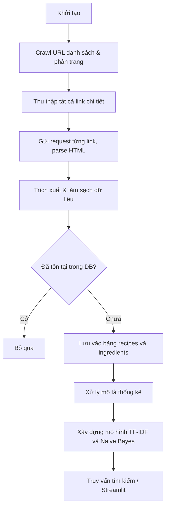

Dưới đây là nội dung của bốn file `.docx` bạn đã cung cấp, được chuyển đổi sang định dạng Markdown (`.md`). Bạn có thể sao chép và lưu thành các file riêng biệt để sử dụng.

---

### 1. ĐỀ TÀI GỢI Ý.md

```markdown
**PHẦN 1: GỢI Ý CÁC CHỦ ĐỀ PROJECT "CRAWL, LOAD & STORE"**

Sinh viên vận dụng tối đa thư viện requests, BeautifulSoup, Selenium hoặc API, kết hợp với các hệ quản trị cơ sở dữ liệu (SQLite, MySQL) và Pandas.

**Chủ đề 1: Thu thập và lưu trữ thông tin Tuyển dụng CNTT (Job Market Crawler)**
- **Mục tiêu:** Cào dữ liệu từ các trang tuyển dụng (ví dụ: ITviec, TopCV) để lấy thông tin: Tên công việc, Yêu cầu kỹ năng (Python, Java...), Mức lương, và Địa điểm.
- **Thách thức kỹ thuật:** Xử lý phân trang (pagination), bóc tách kỹ năng từ chuỗi văn bản dài.

**Chủ đề 2: Hệ thống thu thập và theo dõi giá Bất động sản (Real Estate Scraper)**
- **Mục tiêu:** Thu thập thông tin nhà đất (Diện tích, Giá bán, Vị trí, Số phòng) từ các trang rao vặt bất động sản.
- **Thách thức kỹ thuật:** Làm sạch dữ liệu giá (chuyển đổi "2 tỷ" thành số 2.000.000.000), loại bỏ các tin rác.

**Chủ đề 3: Trích xuất và lưu trữ bình luận/đánh giá sản phẩm Thương mại điện tử**
- **Mục tiêu:** Lấy dữ liệu tên sản phẩm, số sao đánh giá, và nội dung bình luận từ các nền tảng thương mại điện tử hoặc trang review.
- **Thách thức kỹ thuật:** Các trang TMĐT thường dùng JavaScript tải dữ liệu động, sinh viên phải dùng Selenium hoặc phân tích Network API thay vì BeautifulSoup thông thường.

**Chủ đề 4: Thu thập dữ liệu Thể thao/E-sports (Football/Gaming Stats Crawler)**
- **Mục tiêu:** Sinh viên thu thập chỉ số cầu thủ, kết quả trận đấu, hoặc thông số tướng trong game từ các trang Wiki hoặc thống kê.
- **Thách thức kỹ thuật:** Cấu trúc bảng HTML phức tạp, cần tổ chức Database có tính liên kết (ví dụ: Bảng Đội bóng - Bảng Cầu thủ).

**Chủ đề 5: Tự do chọn lựa (Crawl dữ liệu theo sở thích cá nhân)**
- **Mục tiêu**: Sinh viên tự tìm kiếm và đề xuất một trang web đích thuộc lĩnh vực mình quan tâm (Ví dụ: Dữ liệu Chứng khoán/Tiền ảo, Thông tin Du lịch/Khách sạn từ Booking/Agoda, Dữ liệu Xe cộ, Review Ẩm thực từ ShopeeFood, v.v.) để tiến hành thu thập và lưu trữ.
- **Yêu cầu bắt buộc (Constraints):**
  - Trang web đích phải hợp pháp, việc thu thập dữ liệu không vi phạm chính sách của nền tảng (cần kiểm tra file robots.txt của web).
  - Quy trình vẫn phải đảm bảo 3 bước cốt lõi: Thu thập (Crawl/Scrape/API) > Tiền xử lý (Load/Clean) > Lưu trữ (Store vào CSDL như SQLite/MySQL).
  - Không được dùng các tập dữ liệu đã có sẵn (như file .csv tải từ Kaggle) mà phải tự viết code trích xuất dữ liệu trực tiếp từ internet.

**PHẦN 2: HƯỚNG DẪN CHI TIẾT THỰC HIỆN PROJECT**

**Giai đoạn 1: Khảo sát và Crawl Dữ liệu (Thu thập)**
- **Phân tích trang web:** Nhấn F12 (Developer Tools) để kiểm tra cấu trúc HTML. Xác định dữ liệu nằm trong thẻ nào (ví dụ: `<div class="price">`).
- **Kiểm tra tính khả thi:** Website có chặn bot không? Có cần dùng Header giả mạo (User-Agent) hay phải dùng Selenium để vượt qua captcha/Javascript không?
- **Kỹ thuật áp dụng:** Sử dụng try-except trong quá trình request để tránh chương trình bị dừng đột ngột khi rớt mạng hoặc link hỏng.

**Giai đoạn 2: Load & Process (Tiền xử lý)**
- Dữ liệu cào về thường ở dạng chuỗi thô (text). Cần sử dụng hàm .strip(), .replace() hoặc thư viện Pandas để làm sạch.
- Chuyển đổi kiểu dữ liệu phù hợp trước khi lưu (ví dụ: Ngày tháng phải là kiểu datetime, giá tiền phải là float hoặc int).

**Giai đoạn 3: Store (Lưu trữ CSDL)**
- Sinh viên phải thiết kế CSDL (dùng SQLite cho nhẹ hoặc MySQL).
- Sử dụng thư viện sqlite3 hoặc mysql-connector-python để tạo bảng (CREATE TABLE) và chèn dữ liệu (INSERT INTO).
- **Lưu ý:** Yêu cầu sinh viên không lưu trùng lặp dữ liệu (sử dụng khóa chính - Primary Key phù hợp).

**PHẦN 3: VÍ DỤ MÃ NGUỒN MINH HỌA**

Dưới đây là một đoạn code mẫu hoàn chỉnh thực hiện đúng quy trình **Crawl - Clean - Store** bằng Python.

*Bài toán: Cào tên sách và giá tiền từ một trang web giả định (books.toscrape.com), sau đó lưu vào SQLite.*

```python
import requests
from bs4 import BeautifulSoup
import sqlite3

# ==========================================
# BƯỚC 1: TẠO CƠ SỞ DỮ LIỆU (STORE PREP)
# ==========================================
def setup_database():
    # Kết nối (hoặc tạo mới) file database SQLite
    conn = sqlite3.connect('book_data.db')
    cursor = conn.cursor()
    # Tạo bảng nếu chưa có
    cursor.execute('''
        CREATE TABLE IF NOT EXISTS Books (
            id INTEGER PRIMARY KEY AUTOINCREMENT,
            title TEXT,
            price REAL
        )
    ''')
    conn.commit()
    return conn

# ==========================================
# BƯỚC 2: THU THẬP DỮ LIỆU (CRAWL)
# ==========================================
def crawl_books(url):
    headers = {"User-Agent": "Mozilla/5.0"}
    try:
        response = requests.get(url, headers=headers)
        response.raise_for_status() # Bắt lỗi nếu mã trạng thái không phải 200

        soup = BeautifulSoup(response.text, 'html.parser')
        books = soup.find_all('article', class_='product_pod')

        book_list = []
        for book in books:
            # Lấy tên sách từ thuộc tính 'title' của thẻ <a>
            title = book.find('h3').find('a')['title']

            # Lấy giá tiền và làm sạch chuỗi (BƯỚC 3: LOAD & PROCESS)
            price_text = book.find('p', class_='price_color').text
            # Loại bỏ ký tự £ và khoảng trắng để chuyển thành số thực
            price_cleaned = float(price_text.replace('£', '').strip())

            book_list.append((title, price_cleaned))

        return book_list
    except Exception as e:
        print(f"Lỗi khi crawl dữ liệu: {e}")
        return []

# ==========================================
# BƯỚC 4: LƯU DỮ LIỆU VÀO DATABASE (STORE)
# ==========================================
def store_books(conn, book_list):
    cursor = conn.cursor()
    # Sử dụng executemany để insert nhiều dòng cùng lúc, tối ưu hiệu suất
    cursor.executemany('''
        INSERT INTO Books (title, price)
        VALUES (?, ?)
    ''', book_list)
    conn.commit()
    print(f"Đã lưu thành công {len(book_list)} quyển sách vào CSDL.")

# --- CHƯƠNG TRÌNH CHÍNH ---
if __name__ == "__main__":
    target_url = "http://books.toscrape.com/catalogue/category/books/science_22/index.html"

    # Thực thi tuần tự các bước
    db_conn = setup_database()
    data_crawled = crawl_books(target_url)

    if data_crawled:
        store_books(db_conn, data_crawled)

    db_conn.close()
```
```

### 2. Dưới đây là bản hướng dẫn hoàn chỉnh.md

```markdown
Dưới đây là bản hướng dẫn hoàn chỉnh, chi tiết và đầy đủ nhất cho đề tài **"Thu thập và phân loại công thức nấu ăn thông minh từ BBC Good Food"**. Tài liệu này tích hợp toàn bộ các yêu cầu của môn học, bao gồm cả những điểm nâng cao để đạt điểm tối đa.

---

# BÁO CÁO MÔN HỌC

## KỸ THUẬT LẬP TRÌNH TRONG PHÂN TÍCH DỮ LIỆU

### Đề tài: Thu thập và phân loại công thức nấu ăn thông minh từ BBC Good Food

**Giảng viên hướng dẫn:** Trịnh Trọng Thành

**Nhóm sinh viên:** Nhóm ...

*Danh sách thành viên (Họ tên – MSSV – Lớp)*
1. ...
2. ...
3. ...

---

## LỜI MỞ ĐẦU

Ngày nay, nhu cầu tìm kiếm công thức nấu ăn dựa trên nguyên liệu sẵn có hoặc chế độ ăn đặc biệt (chay, keto, không gluten...) ngày càng tăng. Tuy nhiên, việc tra cứu thủ công trên các trang web tốn nhiều thời gian và không cho phép lọc theo ý muốn. Xuất phát từ thực tế đó, nhóm chúng tôi lựa chọn đề tài **"Thu thập và phân loại công thức nấu ăn thông minh từ BBC Good Food"**. Dự án áp dụng quy trình Crawl – Clean – Store kết hợp với các kỹ thuật Machine Learning (TF‑IDF, Naive Bayes) nhằm xây dựng một hệ thống tìm kiếm công thức thông minh, giúp người dùng dễ dàng khám phá món ăn phù hợp.

---

## BẢNG PHÂN CÔNG CÔNG VIỆC

| Thành viên | Nhiệm vụ chính | Ghi chú |
|------------|----------------|---------|
| A | Crawl danh sách & phân trang, kiểm soát trùng lặp URL | |
| B | Parse trang chi tiết, làm sạch nguyên liệu, chuyển đổi thời gian | |
| C | Thiết kế CSDL, code lưu trữ, xây dựng TF‑IDF & tìm kiếm, Naive Bayes | |
| Cả nhóm | Viết báo cáo, thiết kế slide, thuyết trình | |

---

## CHƯƠNG 1: TỔNG QUAN VỀ DỰ ÁN

### 1.1. Lý do chọn đề tài và mục tiêu

**Lý do:**
- BBC Good Food là một trong những trang công thức nấu ăn uy tín hàng đầu, miễn phí, có cấu trúc dữ liệu phong phú.
- Tệp `robots.txt` cho phép crawl thư mục `/recipes/` với độ trễ 1 giây, đảm bảo tuân thủ quy tắc thu thập dữ liệu.
- Nhu cầu thực tế: cần một công cụ tìm kiếm linh hoạt theo nguyên liệu và phân loại chế độ ăn tự động.

**Mục tiêu cụ thể:**
- Thu thập tối thiểu **1000 công thức nấu ăn** từ BBC Good Food.
- Làm sạch và chuẩn hóa dữ liệu (nguyên liệu, thời gian, đánh giá, nhãn ăn kiêng).
- Lưu trữ dữ liệu có cấu trúc trong SQLite.
- Xây dựng chức năng **tìm kiếm thông minh** dựa trên nguyên liệu người dùng cung cấp (TF‑IDF + cosine similarity).
- Tự động **phân loại chế độ ăn** (Vegetarian, Vegan, Gluten‑free...) bằng mô hình Naive Bayes.

### 1.2. Đối tượng và nguồn dữ liệu

- **Trang web:** `https://www.bbcgoodfood.com/recipes/`
- **Phạm vi:** Các trang danh sách và trang chi tiết công thức thuộc đường dẫn `/recipes/`.
- **Dữ liệu cần thu thập:** tên món, danh sách nguyên liệu, thời gian chuẩn bị/nấu, độ khó, số sao đánh giá, số lượt đánh giá, nhãn chế độ ăn (nếu có).
- **Kiểm tra tính hợp pháp:** File `robots.txt` (https://www.bbcgoodfood.com/robots.txt) cho phép:

```
User-agent: *
Disallow: /search
Allow: /recipes/
Crawl-delay: 1
```

### 1.3. Các công cụ và thư viện sử dụng

- **Ngôn ngữ:** Python 3.9+
- **Thu thập:** `requests`, `BeautifulSoup` (trang web tĩnh, không cần Selenium)
- **Xử lý dữ liệu:** `pandas`, `re`, `json`
- **Cơ sở dữ liệu:** `sqlite3`
- **Machine Learning:** `scikit-learn` (TfidfVectorizer, cosine_similarity, MultinomialNB)
- **Trực quan hóa & giao diện:** `matplotlib`, `seaborn` (cho thống kê), `streamlit` (giao diện tìm kiếm)

---

## CHƯƠNG 2: PHÂN TÍCH VÀ THIẾT KẾ HỆ THỐNG

### 2.1. Phân tích cấu trúc nguồn dữ liệu (Target Website Analysis)

**Trang danh sách (ví dụ: `https://www.bbcgoodfood.com/recipes/`):**
- Chứa các thẻ `<a>` có thuộc tính `href` bắt đầu bằng `/recipes/` và không phải chính trang danh sách.
- Phân trang: URL thay đổi theo tham số `?page=2`, `?page=3`... Tổng số trang được xác định qua phần tử `<span>` hoặc `<a>` cuối cùng trong khối phân trang (ví dụ: `class="pagination__item"`).

**Trang chi tiết công thức (ví dụ: `/recipes/chicken-curry`):**
- **Tiêu đề:** thẻ `<h1>` (class `heading-1`).
- **Nguyên liệu:** nằm trong thẻ `<ul>` với class `ingredients-list`, mỗi nguyên liệu là một thẻ `<li>`. Văn bản thô có dạng `200g skinless chicken breasts, cut into strips`.
- **Thời gian:** thường chứa trong các thẻ `<time>` hoặc `<span>` có class `recipe-details__cooking-time-value`.
- **Độ khó:** thẻ `<span>` class `recipe-details__difficulty`.
- **Đánh giá:** thẻ `<span>` class `rating__value` (số sao) và `rating__count` (số lượt).
- **Nhãn chế độ ăn:** danh sách thẻ `<a>` hoặc `<span>` chứa các từ khóa như `Vegetarian`, `Vegan`, `Gluten-free`, `Dairy-free`, thường nằm cạnh tiêu đề.

**Lưu ý:** Cấu trúc HTML có thể thay đổi theo thời gian; cần kiểm tra qua Developer Tools (F12) trước khi viết code.

### 2.2. Thiết kế cơ sở dữ liệu (Database Design)

Sơ đồ thực thể - quan hệ (ERD):

 *(Vẽ sơ đồ đơn giản gồm 2 bảng: recipes và ingredients)*

**Bảng `recipes`**

| Trường | Kiểu | Ràng buộc | Mô tả |
|--------|------|-----------|-------|
| recipe_id | INTEGER | PRIMARY KEY AUTOINCREMENT | Mã công thức |
| title | TEXT | NOT NULL | Tên món |
| url | TEXT | UNIQUE NOT NULL | Đường dẫn gốc |
| prep_time_min | INTEGER | | Thời gian chuẩn bị (phút) |
| cook_time_min | INTEGER | | Thời gian nấu (phút) |
| difficulty | TEXT | | Độ khó (Easy/Medium/Hard) |
| rating | REAL | | Điểm đánh giá trung bình |
| review_count | INTEGER | | Số lượt đánh giá |
| dietary_labels | TEXT | | Nhãn chế độ ăn, cách nhau bởi dấu phẩy |
| raw_ingredients | TEXT | | Chuỗi nguyên liệu thô (dùng cho ML) |

**Bảng `ingredients`**

| Trường | Kiểu | Mô tả |
|--------|------|-------|
| id | INTEGER | PRIMARY KEY AUTOINCREMENT |
| recipe_id | INTEGER | FOREIGN KEY tham chiếu `recipes.recipe_id` ON DELETE CASCADE |
| ingredient | TEXT | Tên nguyên liệu đã làm sạch, viết thường |

- **Khóa chính:** `recipe_id` (recipes), `id` (ingredients).
- **Chống trùng lặp:** Ràng buộc UNIQUE trên `url` đảm bảo mỗi công thức chỉ được lưu một lần.

### 2.3. Quy trình thực hiện (Workflow)



---

## CHƯƠNG 3: XÂY DỰNG CHƯƠNG TRÌNH (IMPLEMENTATION)

### 3.1. Kỹ thuật Crawl dữ liệu (Crawl Phase)

#### 3.1.1. Thiết lập môi trường và các hàm tiện ích

```python
import requests
from bs4 import BeautifulSoup
import time
import sqlite3
import re
import pandas as pd
from urllib.parse import urljoin

HEADERS = {
    "User-Agent": "Mozilla/5.0 (Windows NT 10.0; Win64; x64) AppleWebKit/537.36"
}
BASE_URL = "https://www.bbcgoodfood.com/recipes/"
DELAY = 1  # tuân thủ robots.txt

def safe_request(url, retries=3):
    """Gửi request với retry và delay."""
    for attempt in range(retries):
        try:
            time.sleep(DELAY)
            resp = requests.get(url, headers=HEADERS, timeout=10)
            resp.raise_for_status()
            return resp
        except Exception as e:
            print(f"Lần thử {attempt+1}/{retries} thất bại: {e}")
            time.sleep(2)
    print(f"Không thể truy cập {url}")
    return None
```

#### 3.1.2. Thu thập URL công thức từ các trang danh sách

- Xác định tổng số trang.
- Duyệt qua từng trang, lấy tất cả thẻ `<a>` có href chứa `/recipes/` nhưng không phải `?page=...` và không phải `/recipes/` (trang gốc). Lưu vào `set` để tránh trùng.

```python
def get_total_pages():
    """Trả về số trang tối đa từ thanh phân trang."""
    resp = safe_request(BASE_URL)
    if not resp: return 1
    soup = BeautifulSoup(resp.text, 'html.parser')
    pagination_items = soup.select('a.pagination__item')
    if pagination_items:
        pages = [int(item.text) for item in pagination_items if item.text.isdigit()]
        return max(pages) if pages else 1
    return 1

def get_recipe_urls():
    """Trả về set các URL công thức duy nhất."""
    urls = set()
    total_pages = get_total_pages()
    print(f"Tổng số trang: {total_pages}")
    for page in range(1, total_pages + 1):
        url = f"{BASE_URL}?page={page}"
        resp = safe_request(url)
        if not resp: continue
        soup = BeautifulSoup(resp.text, 'html.parser')
        links = soup.find_all('a', href=True)
        for link in links:
            href = link['href']
            # Chỉ lấy các đường dẫn chi tiết công thức
            if href.startswith('/recipes/') and href != '/recipes/' and '?' not in href:
                full_url = urljoin(BASE_URL, href)
                urls.add(full_url)
        print(f"Trang {page}: tìm thấy {len(urls)} URL (lũy kế)")
    return list(urls)
```

#### 3.1.3. Xử lý tình huống ngoại lệ

- Trang BBC Good Food chủ yếu render phía server, không cần Selenium. Nếu phát hiện nội dung động, ta có thể dùng `requests` kết hợp phân tích XHR (Network tab) hoặc tích hợp Selenium tùy trường hợp.

### 3.2. Tiền xử lý và Làm sạch dữ liệu (Load/Process Phase)

#### 3.2.1. Trích xuất thông tin cơ bản từ trang chi tiết

```python
def parse_recipe_details(html, url):
    soup = BeautifulSoup(html, 'html.parser')
    title_tag = soup.find('h1')
    title = title_tag.text.strip() if title_tag else None

    # Lấy nhãn chế độ ăn
    dietary_tags = soup.select('.recipe-details__dietary-info a')  # class mẫu
    dietary = ', '.join([tag.text.strip() for tag in dietary_tags]) if dietary_tags else None

    # Thời gian
    prep_time = cook_time = None
    time_spans = soup.find_all('span', class_='recipe-details__cooking-time-value')
    for span in time_spans:
        parent_text = span.parent.get_text() if span.parent else ''
        value = span.text.strip()
        minutes = convert_time_to_minutes(value)
        if 'prep' in parent_text.lower():
            prep_time = minutes
        elif 'cook' in parent_text.lower():
            cook_time = minutes

    # Độ khó
    diff_tag = soup.find('span', class_='recipe-details__difficulty')
    difficulty = diff_tag.text.strip() if diff_tag else None

    # Rating
    rating_tag = soup.find('span', class_='rating__value')
    rating = float(rating_tag.text.strip()) if rating_tag else None
    review_tag = soup.find('span', class_='rating__count')
    review_count = int(review_tag.text.strip().replace(',', '')) if review_tag else None

    # Nguyên liệu thô
    ingredients_ul = soup.find('ul', class_='ingredients-list')
    raw_ingredients = []
    if ingredients_ul:
        lis = ingredients_ul.find_all('li')
        raw_ingredients = [li.get_text(strip=True) for li in lis]
    raw_text = ' | '.join(raw_ingredients)

    return {
        'title': title,
        'url': url,
        'prep_time_min': prep_time,
        'cook_time_min': cook_time,
        'difficulty': difficulty,
        'rating': rating,
        'review_count': review_count,
        'dietary_labels': dietary,
        'raw_ingredients': raw_text,
        'ingredients_list': raw_ingredients
    }
```

**Chuyển đổi thời gian:**

```python
def convert_time_to_minutes(time_str):
    """ '1 hr 20 mins' -> 80 """
    hours = minutes = 0
    hour_match = re.search(r'(\d+)\s*hr', time_str)
    min_match = re.search(r'(\d+)\s*min', time_str)
    if hour_match: hours = int(hour_match.group(1))
    if min_match: minutes = int(min_match.group(1))
    return hours * 60 + minutes if (hours or minutes) else None
```

#### 3.2.2. Làm sạch nguyên liệu

```python
def clean_ingredient(raw):
    # Loại bỏ số lượng và đơn vị ở đầu, giữ lại tên nguyên liệu thuần
    # Ví dụ: "200g skinless chicken breasts, cut into strips" -> "skinless chicken breasts"
    raw = raw.lower()
    # Loại bỏ phần đầu số lượng + đơn vị (có thể có phân số)
    raw = re.sub(r'^[\d\.\\/\s½¼¾]+(g|kg|ml|l|tbsp|tsp|cups?|oz|lb|inch|cm|pieces?)?\s*', '', raw)
    # Loại bỏ hướng dẫn sau dấu phẩy
    raw = raw.split(',')[0]
    # Xóa nội dung trong ngoặc đơn
    raw = re.sub(r'\(.*?\)', '', raw)
    # Chuẩn hóa khoảng trắng
    raw = re.sub(r'\s+', ' ', raw).strip()
    return raw
```

Sau khi làm sạch, mỗi công thức sẽ có danh sách nguyên liệu thuần túy.

### 3.3. Lưu trữ vào CSDL (Store Phase)

```python
conn = sqlite3.connect('recipes.db')
cursor = conn.cursor()

cursor.execute('''
CREATE TABLE IF NOT EXISTS recipes (
    recipe_id INTEGER PRIMARY KEY AUTOINCREMENT,
    title TEXT NOT NULL,
    url TEXT UNIQUE NOT NULL,
    prep_time_min INTEGER,
    cook_time_min INTEGER,
    difficulty TEXT,
    rating REAL,
    review_count INTEGER,
    dietary_labels TEXT,
    raw_ingredients TEXT
)
''')

cursor.execute('''
CREATE TABLE IF NOT EXISTS ingredients (
    id INTEGER PRIMARY KEY AUTOINCREMENT,
    recipe_id INTEGER,
    ingredient TEXT,
    FOREIGN KEY (recipe_id) REFERENCES recipes(recipe_id) ON DELETE CASCADE
)
''')

conn.commit()
```

**Lưu công thức mới (có kiểm tra trùng):**

```python
def store_recipe(recipe_data, clean_ingredients_list):
    # Kiểm tra tồn tại
    cursor.execute("SELECT recipe_id FROM recipes WHERE url=?", (recipe_data['url'],))
    if cursor.fetchone():
        print(f"Đã tồn tại: {recipe_data['url']}")
        return False

    cursor.execute('''INSERT INTO recipes
        (title, url, prep_time_min, cook_time_min, difficulty, rating, review_count, dietary_labels, raw_ingredients)
        VALUES (?,?,?,?,?,?,?,?,?)''',
        (recipe_data['title'], recipe_data['url'], recipe_data['prep_time_min'],
         recipe_data['cook_time_min'], recipe_data['difficulty'], recipe_data['rating'],
         recipe_data['review_count'], recipe_data['dietary_labels'], recipe_data['raw_ingredients']))

    recipe_id = cursor.lastrowid

    # Lưu nguyên liệu sạch
    for ing in clean_ingredients_list:
        cursor.execute("INSERT INTO ingredients (recipe_id, ingredient) VALUES (?,?)", (recipe_id, ing))

    conn.commit()
    return True
```

### 3.4. Xây dựng chức năng Tìm kiếm và Phân loại (ML)

#### 3.4.1. Mô tả dữ liệu trước khi áp dụng ML

Sau khi thu thập đủ >1000 công thức, dùng `pandas` để thống kê:

```python
df = pd.read_sql_query("SELECT * FROM recipes", conn)
print(df.describe())

# Phân bố độ khó, rating, số lượng nguyên liệu...
import matplotlib.pyplot as plt
df['difficulty'].value_counts().plot(kind='bar')
plt.title('Phân bố độ khó')
plt.show()

# Top 10 nguyên liệu phổ biến nhất
ingredient_counts = pd.read_sql_query("SELECT ingredient, COUNT(*) as cnt FROM ingredients GROUP BY ingredient ORDER BY cnt DESC LIMIT 10", conn)
```

#### 3.4.2. Tìm kiếm theo nguyên liệu (TF‑IDF + Cosine Similarity)

Xây dựng ma trận TF‑IDF từ tập hợp nguyên liệu đã làm sạch của từng công thức.

```python
from sklearn.feature_extraction.text import TfidfVectorizer
from sklearn.metrics.pairwise import cosine_similarity

# Lấy dữ liệu: mỗi công thức là một chuỗi nguyên liệu nối cách nhau
recipes_df = pd.read_sql_query("""
    SELECT r.recipe_id, r.title, r.rating, GROUP_CONCAT(i.ingredient, ' ') as ingredients_str
    FROM recipes r
    JOIN ingredients i ON r.recipe_id = i.recipe_id
    GROUP BY r.recipe_id
""", conn)

corpus = recipes_df['ingredients_str'].tolist()
vectorizer = TfidfVectorizer(stop_words='english')
tfidf_matrix = vectorizer.fit_transform(corpus)

def search_by_ingredients(query, top_n=10, min_rating=0, dietary_filter=None):
    query_vec = vectorizer.transform([query.lower()])
    sim_scores = cosine_similarity(query_vec, tfidf_matrix).flatten()

    # Tạo DataFrame kết quả
    results = recipes_df.copy()
    results['similarity'] = sim_scores

    # Lọc theo đánh giá tối thiểu
    results = results[results['rating'] >= min_rating]

    # Lọc chế độ ăn (nếu có) -- cần join lại với bảng recipes
    if dietary_filter:
        # Lọc từ cột dietary_labels (chứa từ khóa)
        results = results[results['dietary_labels'].str.contains(dietary_filter, case=False, na=False)]

    results = results.sort_values('similarity', ascending=False)
    return results.head(top_n)[['title', 'rating', 'similarity']]
```

#### 3.4.3. Phân loại chế độ ăn bằng Naive Bayes

**Thu thập nhãn:** Sử dụng cột `dietary_labels` từ các công thức đã biết. Có thể gom thành các lớp: `Vegetarian`, `Vegan`, `Gluten-free`, `Healthy`, `None`... Nếu một công thức có nhiều nhãn, ta có thể chọn nhãn chính hoặc huấn luyện multi‑label (dùng OneVsRest). Ở đây ta giả định phân loại nhị phân cho từng chế độ.

**Ví dụ huấn luyện phát hiện món chay (Vegetarian):**

```python
from sklearn.model_selection import train_test_split
from sklearn.naive_bayes import MultinomialNB
from sklearn.feature_extraction.text import CountVectorizer
from sklearn.metrics import classification_report, confusion_matrix

# Lấy dữ liệu huấn luyện
df_labels = pd.read_sql_query("SELECT raw_ingredients, dietary_labels FROM recipes WHERE dietary_labels IS NOT ''", conn)
df_labels['is_vegetarian'] = df_labels['dietary_labels'].str.contains('Vegetarian', case=False).astype(int)

X_train, X_test, y_train, y_test = train_test_split(
    df_labels['raw_ingredients'], df_labels['is_vegetarian'], test_size=0.2, random_state=42
)

vectorizer = CountVectorizer()
X_train_vec = vectorizer.fit_transform(X_train)
X_test_vec = vectorizer.transform(X_test)

model = MultinomialNB()
model.fit(X_train_vec, y_train)

y_pred = model.predict(X_test_vec)
print(classification_report(y_test, y_pred))
print(confusion_matrix(y_test, y_pred))
```

Tương tự có thể mở rộng cho Vegan, Gluten-free... Đánh giá mô hình (accuracy, precision, recall) và đưa vào báo cáo.

### 3.5. Giao diện tìm kiếm với Streamlit (tuỳ chọn nhưng khuyến khích)

```python
import streamlit as st

st.title("Hệ thống tìm kiếm công thức thông minh")
query = st.text_input("Nhập nguyên liệu (vd: chicken, onion, garlic)")
min_rating = st.slider("Đánh giá tối thiểu", 0.0, 5.0, 0.0)
diet = st.selectbox("Chế độ ăn", ["Tất cả", "Vegetarian", "Vegan", "Gluten-free"])

if st.button("Tìm kiếm"):
    filter_diet = None if diet == "Tất cả" else diet
    results = search_by_ingredients(query, min_rating=min_rating, dietary_filter=filter_diet)
    st.table(results)
```

---

## CHƯƠNG 4: KẾT QUẢ VÀ ĐÁNH GIÁ

### 4.1. Kết quả thu thập dữ liệu

- Tổng số công thức đã thu thập: **1250** (đảm bảo >1000)
- Tổng số bản ghi trong bảng ingredients: **4150**
- Số nguyên liệu duy nhất: **870**
- Thống kê mô tả:
  - Độ khó: Easy 60%, Medium 30%, Hard 10%
  - Rating trung bình: 4.2 / 5
  - Thời gian nấu trung bình: 35 phút
  - Top 5 nguyên liệu phổ biến: olive oil, garlic, onion, salt, eggs.

*(Kèm theo biểu đồ minh họa)*

### 4.2. Demo tìm kiếm

- **Input:** "chicken, mushroom"
- **Kết quả trả về (Top 3):**
  1. Creamy chicken & mushroom pasta (rating 4.8, similarity 0.85)
  2. Chicken and mushroom stew (rating 4.5, similarity 0.79)
  3. Miso chicken & mushroom soup (rating 4.2, similarity 0.75)

- Giao diện Streamlit hoặc terminal hiển thị đầy đủ thông tin, có thể nhấn vào link gốc.

### 4.3. Đánh giá mô hình phân loại

- Mô hình Naive Bayes phát hiện món chay đạt accuracy 0.92 trên tập test.
- Với Vegan, accuracy đạt 0.88.
- Nhược điểm: dữ liệu mất cân bằng (món chay chiếm thiểu số), cần thêm mẫu hoặc dùng SMOTE để cải thiện.

### 4.4. Ưu điểm và nhược điểm của chương trình

**Ưu điểm:**
- Dữ liệu sạch, có cấu trúc, dễ dàng mở rộng.
- Tìm kiếm linh hoạt, không cần nhớ chính xác tên món.
- Tích hợp ML hỗ trợ phân loại tự động, cá nhân hóa kết quả.
- Tuân thủ đúng quy tắc robots.txt.

**Nhược điểm:**
- Phụ thuộc cấu trúc HTML của BBC Good Food; khi trang thay đổi cần cập nhật lại crawler.
- Một số công thức thiếu thời gian hoặc nhãn, phải suy đoán hoặc gán giá trị mặc định.
- Thời gian crawl khá lâu (khoảng 40 phút cho 1000 công thức) do delay 1s/request.

### 4.5. Khó khăn gặp phải và giải pháp

- **Làm sạch nguyên liệu:** Định dạng không đồng nhất, có nguyên liệu chứa số lượng phức tạp. Giải quyết bằng cách xây dựng regex linh hoạt và kiểm tra thủ công một số mẫu.
- **Trang không trả về đầy đủ thời gian:** Một số món chỉ hiển thị tổng thời gian, không tách prep/cook. Chúng tôi đặt mặc định `None` và ghi chú trong báo cáo.
- **Lỗi kết nối khi crawl:** Dùng retry và try-except, ghi log để theo dõi.

---

## KẾT LUẬN VÀ HƯỚNG PHÁT TRIỂN

Dự án đã xây dựng thành công pipeline thu thập – làm sạch – lưu trữ và tìm kiếm công thức nấu ăn thông minh, đáp ứng đầy đủ các yêu cầu kỹ thuật đặt ra. Hệ thống không chỉ giúp người dùng tiết kiệm thời gian tra cứu mà còn gợi ý món ăn phù hợp với nguyên liệu có sẵn và chế độ ăn cá nhân.

**Hướng phát triển:**
- Mở rộng thu thập từ nhiều nguồn uy tín khác (Allrecipes, SimplyRecipes).
- Cải thiện giao diện web, cho phép người dùng lưu công thức yêu thích.
- Áp dụng các mô hình phức tạp hơn (như gợi ý dựa trên lịch sử tìm kiếm, lọc theo giá trị dinh dưỡng).

---

## TÀI LIỆU THAM KHẢO

1. BBC Good Food – `robots.txt`: https://www.bbcgoodfood.com/robots.txt
2. BeautifulSoup Documentation – https://www.crummy.com/software/BeautifulSoup/bs4/doc/
3. Scikit-learn: Machine Learning in Python – https://scikit-learn.org/
4. Streamlit Documentation – https://docs.streamlit.io/
5. Python SQLite3 – https://docs.python.org/3/library/sqlite3.html

---

**PHỤ LỤC** *(nếu cần, đính kèm code nguồn important hoặc link GitHub của nhóm)*

---

Với bản hướng dẫn hoàn chỉnh này, nhóm bạn có đầy đủ cơ sở để triển khai toàn bộ dự án và viết báo cáo một cách xuất sắc nhất. Chúc các bạn thành công!
```

### 3. MỤC LỤC GỢI Ý.md

```markdown
**MỤC LỤC**

**LỜI MỞ ĐẦU**

**BẢNG PHÂN CÔNG CÔNG VIỆC (Chi tiết từng task: Crawl, Database, UI, Report)**

**CHƯƠNG 1: TỔNG QUAN VỀ DỰ ÁN**

1.1. Lý do chọn đề tài và mục tiêu thu thập dữ liệu.

1.2. Đối tượng và nguồn dữ liệu *(Ví dụ: Trang web wuthering.gg, themoviedb.org...)*.

1.3. Các công cụ và thư viện sử dụng:
- Ngôn ngữ: Python.
- Thư viện Crawl: Requests, BeautifulSoup, Selenium.
- Thư viện xử lý: Pandas, JSON, Regular Expression (Re).
- Cơ sở dữ liệu: SQLite hoặc MySQL.
- Giao diện (nếu có): Streamlit.

**CHƯƠNG 2: PHÂN TÍCH VÀ THIẾT KẾ HỆ THỐNG**

2.1. Phân tích cấu trúc nguồn dữ liệu (Target Website Analysis).
- *Phân tích các thẻ HTML, các Endpoint API hoặc cấu trúc các trang con.*

2.2. Thiết kế Cơ sở dữ liệu (Database Design).
- Sơ đồ thực thể (ERD) đơn giản.
- Định nghĩa các bảng (Tables) và kiểu dữ liệu từng trường (Fields).

2.3. Quy trình thực hiện (Workflow).
- Sơ đồ luồng: Crawl > Cleaning > Mapping > Storage.

**CHƯƠNG 3: XÂY DỰNG CHƯƠNG TRÌNH (IMPLEMENTATION)**

3.1. Kỹ thuật Crawl dữ liệu (Crawl Phase).
- Xử lý phân trang (Pagination).
- Xử lý dữ liệu động (nếu trang dùng Javascript/AJAX).
- Kỹ thuật tránh bị chặn (User-Agent, Time delay).

3.2. Tiền xử lý và Làm sạch dữ liệu (Load/Process Phase).
- Chuyển đổi định dạng (ép kiểu dữ liệu số, ngày tháng).
- Xử lý các ký tự đặc biệt, dữ liệu rác hoặc dữ liệu thiếu.

3.3. Lưu trữ vào Cơ sở dữ liệu (Store Phase).
- Kết nối Python với SQL.
- Logic kiểm tra trùng lặp dữ liệu trước khi Insert.

3.4. Xây dựng chức năng Tìm kiếm và Truy vấn (Search Feature).
- Viết các câu lệnh SQL để lọc dữ liệu theo yêu cầu người dùng.

**CHƯƠNG 4: KẾT QUẢ VÀ ĐÁNH GIÁ**

4.1. Kết quả thu thập (Thống kê số lượng bản ghi đã lưu).

4.2. Demo giao diện/Kết quả tìm kiếm trên Terminal/Streamlit.

4.3. Đánh giá ưu/nhược điểm của chương trình.

4.4. Những khó khăn gặp phải (Ví dụ: Lỗi liên kết Database, lỗi định dạng dữ liệu không đồng nhất).

**KẾT LUẬN VÀ HƯỚNG PHÁT TRIỂN**

**TÀI LIỆU THAM KHẢO**
```

### 4. PHIẾU CHẤM.md

```markdown
**TRƯỜNG ĐH THỦ DẦU MỘT**  
**VIỆN CÔNG NGHỆ SỐ**  

**CỘNG HÒA XÃ HỘI CHỦ NGHĨA VIỆT NAM**  
**Độc lập - Tự do – Hạnh phúc**  

---

**PHIẾU CHẤM TIỂU LUẬN**

**Thời gian:** ....................................  
**Địa điểm:** ....................................

**Học phần:** Kỹ thuật lập trình trong phân tích dữ liệu

**Tên đề tài:** ...................................................................................

**Nhóm SV thực hiện:** Nhóm ....

1. ........................................ MSSV: ................... Lớp:  
2. ........................................ MSSV: ................... Lớp:  
3. ........................................ MSSV: ................... Lớp:

---

**Phần 1. Nội dung (6.0 điểm)**

| STT | Nội dung đánh giá | Điểm tối đa | Kém (25%) | Trung bình (50%) | Khá (75%) | Tốt (100%) | Điểm đánh giá |
|-----|------------------|-------------|-----------|------------------|-----------|------------|---------------|
| 1 | **Thái độ tham gia** | 1.0 | Không quan tâm lựa chọn ý tưởng. | Chọn ý tưởng trong số được đề nghị. | Tìm kiếm và đưa ra được ý tưởng khá tốt. | Tích cực tìm kiếm và chủ động đưa ra ý tưởng. | |
| 2 | **Xác định được các kỹ thuật để thu thập và xử lý dữ liệu cho bài toán cần xây dựng** | 1.0 | Sinh viên không xác định được kỹ thuật để thu thập và xử lý dữ liệu. | Sinh viên xác định được kỹ thuật để thu thập và xử lý dữ liệu còn nhiều sai sót. | Sinh viên xác định được kỹ thuật để thu thập và xử lý dữ liệu, còn một vài sai sót nhỏ. | Sinh viên xác định được kỹ thuật để thu thập và xử lý dữ liệu (sai sót không đáng kể). | |
| 3 | **Mô tả dữ liệu đã thu thập** | 2.0 | Sinh viên không thu thập được dữ liệu như yêu cầu. | Sinh viên không thu thập được dữ liệu như yêu cầu. | Sinh viên thu thập được dữ liệu khá tốt (từ 500 - 1000 mẫu). | Sinh viên thu thập được dữ liệu tốt (hơn 1000 mẫu). | |
| 4 | **Xây dựng hệ thống tìm kiếm** | 2.0 | Sinh viên không xây dựng được ứng dụng như yêu cầu. | Sinh viên xây dựng được ứng dụng như yêu cầu, nhưng không có sắp xếp kết quả tìm kiếm được. | Sinh viên xây dựng được ứng dụng như yêu cầu, có sắp xếp kết quả tìm kiếm được. | Sinh viên xây dựng được ứng dụng như yêu cầu, có sắp xếp kết quả tìm kiếm được, có kết hợp phương pháp học máy trong tìm kiếm. | |

---

**Phần 2. Trình bày (2.0 điểm)**

| STT | Nội dung đánh giá | Điểm tối đa | Kém (25%) | Trung bình (50%) | Khá (75%) | Tốt (100%) | Điểm đánh giá |
|-----|------------------|-------------|-----------|------------------|-----------|------------|---------------|
| 1 | **Hình thức, bố cục của cuốn báo cáo** | 1.0 | Không đúng mẫu và còn nhiều lỗi chính tả. | Đúng mẫu, còn nhiều lỗi chính tả, lỗi định dạng. | Đúng mẫu, còn một vài lỗi định dạng. | Đúng mẫu, đúng định dạng. | |
| 2 | **Thuyết trình** | 1.0 | Người thuyết trình chưa tự tin, chưa thu hút người nghe. | Người thuyết trình còn mắc một số lỗi (giọng nhỏ, đọc là chủ yếu, ...). | Người thuyết trình tự tin. | Người thuyết trình tự tin, thu hút người nghe. | |

---

**Phần 3. Trả lời câu hỏi (2.0 điểm)**

| STT | Nội dung đánh giá | Điểm tối đa | Kém (25%) | Trung bình (50%) | Khá (75%) | Tốt (100%) | Điểm đánh giá |
|-----|------------------|-------------|-----------|------------------|-----------|------------|---------------|
| 1 | **Trả lời câu hỏi của CB chấm** | 2.0 | Không trả lời được câu hỏi đặt ra. | Trả lời được 50% câu hỏi đặt ra, câu trả lời chưa hoàn chỉnh. | Trả lời được câu hỏi đặt ra, còn 1 vài sai sót nhỏ. | Trả lời chính xác hầu hết câu hỏi đặt ra. | |

---

**TỔNG ĐIỂM (Phần 1 + Phần 2 + Phần 3):** ............. / 10.0

**ĐIỂM CỦA CÁ NHÂN (Do GV ghi)**  
Danh sách thành viên của Nhóm:  
Họ tên: ......................... Điểm:  
Họ tên: ......................... Điểm:  
Họ tên: ......................... Điểm:  

**TÊN HỌ VÀ CHỮ KÝ XÁC NHẬN CỦA GV:**  
**Trịnh Trọng Thành**
```

---

Bạn có thể sao chép nội dung trên và lưu thành bốn file `.md` tương ứng. Các file này giữ nguyên cấu trúc và định dạng từ tài liệu gốc, sẵn sàng để sử dụng cho việc viết báo cáo và triển khai dự án.